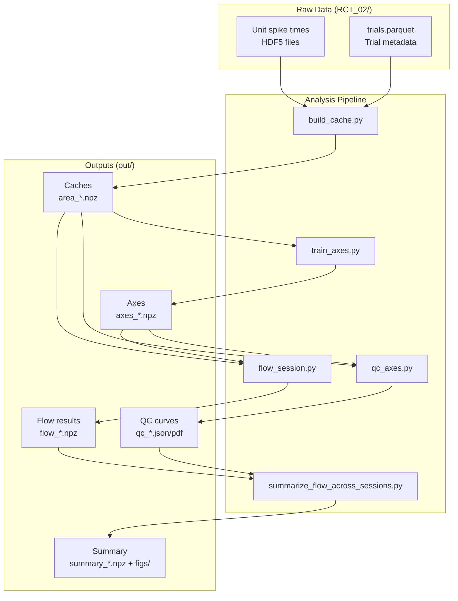

# Project Summary

## TL;DR (5–10 bullets)

- **Neuroscience analysis pipeline** for studying information flow between brain areas (FEF, LIP, SC) in macaque monkeys during a category-saccade task
- **Ridge regression flow analysis**: Measures directed information transfer from area A→B using lagged neural activity projections, with permutation-based null distributions
- **Multi-stage pipeline**: Raw spikes → binned caches → encoding axes (C/R/S/T features) → QC validation → pairwise flow computation → cross-session summary statistics
- **Two monkeys** (M: MFEF/MLIP/MSC; S: SFEF/SLIP/SSC), 23 recording sessions with simultaneous multi-area recordings
- **Three alignment modes**: stimulus onset (stim), saccade onset (sacc), target onset (targ)
- **Encoded features**: Category (C), Direction (R), Saccade direction (S), Target configuration (T), Orientation/context (O)
- **Written in Python** using NumPy, scikit-learn, pandas, h5py, matplotlib
- **Supports SLURM cluster** via array jobs, or local execution
- **Publication-ready outputs**: Summary NPZ files + figure panels (PDF/PNG/SVG) for manuscript

## Background / Problem Statement

This repository implements a neural information flow analysis for investigating how category and decision-related signals propagate between visual and oculomotor brain regions (FEF=Frontal Eye Field, LIP=Lateral Intraparietal area, SC=Superior Colliculus) during a saccade task where monkeys categorize visual stimuli. The core scientific question is: **Which brain areas encode task-relevant information first, and how does this information flow between areas over time?**

The analysis computes a time-resolved ΔLL (delta log-likelihood, converted to bits) metric quantifying how much past activity in area A improves prediction of current activity in area B, beyond B's own self-history. This is a form of Granger causality adapted for neural population data projected onto task-relevant encoding axes.

*(Evidence: `cli/README_summarize_flow.md` lines 1–60; `paperflow/flow.py` docstrings and `compute_flow_timecourse_for_pair` function)*

## Goals

1. **Quantify directed information flow** between brain area pairs (FEF↔LIP, FEF↔SC, LIP↔SC) for each monkey
2. **Compute encoding axes** (linear discriminant subspaces) for category (C), direction (R), saccade (S), and target configuration (T)
3. **Validate encoding quality** via time-resolved QC curves (AUC/accuracy over time)
4. **Generate publication-quality figures** showing flow time courses with error bars and significance markers
5. **Support multiple temporal bin sizes** (5ms, 10ms, 20ms) and window search strategies for axis training

*(Evidence: `cli/README_summarize_flow.md`; SLURM job files in `jobs/`)*

## Non-goals (if explicitly stated; otherwise "Unknown")

Unknown — no explicit non-goals found in documentation.

## What this repo contains (1 paragraph)

This repository contains a complete Python analysis pipeline for neural information flow, including: (1) raw spike data from two monkeys organized by session and brain area in `RCT_02/`, (2) a core library `paperflow/` implementing binning, axis training, QC, and flow computation, (3) CLI scripts in `cli/` for running each pipeline stage, (4) SLURM batch job templates in `jobs/` for cluster execution, (5) pre-computed results in `out/` organized by alignment/session/analysis-type, and (6) configuration files and helper scripts for reproducibility.

---

# Repository Map

## Tech stack (languages, frameworks, major libs)

| Component | Technology |
|-----------|------------|
| Language | Python 3.11+ |
| Scientific computing | NumPy, SciPy (gaussian_filter1d) |
| Machine learning | scikit-learn (LogisticRegression, LinearSVC, LDA, StratifiedKFold, roc_auc_score) |
| Data I/O | pandas (Parquet), h5py (HDF5 spike times), JSON |
| Visualization | matplotlib |
| Job scheduling | SLURM (sbatch array jobs) |

*(Evidence: imports in `paperflow/*.py`; `jobs/*.sbatch` header directives)*

## Directory structure (tree)

```
paper_project_final/
├── paperflow/                 # Core library modules
│   ├── axes.py               # Encoding axis training (C/R/S/T)
│   ├── binning.py            # Spike binning & cache creation
│   ├── flow.py               # Information flow computation
│   ├── io.py                 # Session/area discovery utilities
│   ├── norm.py               # Normalization, rebinning, sliding window
│   ├── pseudo.py             # Pseudopopulation decoding
│   ├── qc.py                 # Quality control curves
│   └── standardize.py        # Regressor z-scoring
├── cli/                       # Command-line scripts (entry points)
│   ├── build_cache.py        # Stage 1: Bin spikes → caches
│   ├── train_axes.py         # Stage 2: Train encoding axes
│   ├── qc_axes.py            # Stage 3: QC validation
│   ├── flow_session.py       # Stage 4: Compute pairwise flow
│   ├── summarize_flow_across_sessions.py  # Stage 5: Aggregate results
│   ├── trial_onset_comprehensive.py       # Onset latency analysis
│   ├── plot_qc_paper.py      # Generate QC figures
│   └── arxiv/                # Additional analysis scripts
├── jobs/                      # SLURM batch job templates
│   ├── peakbin_axes_qc_flow_array_10ms_big.sbatch
│   ├── peakbin_axes_qc_flow_array_20ms_sliding.sbatch
│   └── ... (13+ job files)
├── RCT_02/                    # Raw data (39 sessions)
│   ├── manifest.json         # Session metadata
│   ├── 20231205/             # Example session
│   │   ├── trials.parquet    # Trial metadata (category, direction, etc.)
│   │   └── areas/            # Per-area unit data
│   │       └── SFEF/
│   │           ├── units.json
│   │           └── spikes/unit_*.h5  # Spike times
│   └── ...
├── out/                       # Analysis outputs
│   ├── stim/                 # Stimulus-aligned results
│   │   ├── <session_id>/
│   │   │   ├── caches/       # Binned spike arrays
│   │   │   ├── axes/         # Trained encoding axes
│   │   │   ├── qc/           # QC curves (JSON, PDF, PNG)
│   │   │   └── flow/         # Flow results per tag/feature
│   │   └── summary/          # Cross-session aggregates
│   ├── sacc/                 # Saccade-aligned results (same structure)
│   └── targ/                 # Target-aligned results (same structure)
├── sid_list.txt              # List of 23 session IDs for processing
├── run_summarize_flow_local.sh  # Local execution script
├── check.py                  # Debug/inspection helper
└── logs/                     # SLURM job logs (.out, .err)
```

*(Evidence: `list_dir` outputs; file inspection)*

## Key entry points (what starts what)

| Entry Point | Purpose | Example Invocation |
|-------------|---------|-------------------|
| `cli/build_cache.py` | Bin raw spikes into NPZ caches | `python cli/build_cache.py --root RCT_02 --align stim --sid 20231205` |
| `cli/train_axes.py` | Train encoding axes (C/R/S/T) | `python cli/train_axes.py --align stim --sid 20231205 --features C R --searchC` |
| `cli/qc_axes.py` | Compute time-resolved QC curves | `python cli/qc_axes.py --align stim --sid 20231205 --tag axes_peakbin_stimCR` |
| `cli/flow_session.py` | Compute pairwise information flow | `python cli/flow_session.py --align stim --sid 20231205 --feature C --lags_ms 50` |
| `cli/summarize_flow_across_sessions.py` | Aggregate flow across sessions | `python cli/summarize_flow_across_sessions.py --align stim --tags evoked_peakbin_stimC_vertical_lag50ms-none-trial` |
| `jobs/*.sbatch` | SLURM array jobs for cluster | `sbatch jobs/peakbin_axes_qc_flow_array_10ms_big.sbatch` |

*(Evidence: `cli/*.py` argparse definitions; `jobs/*.sbatch`; `cli/README_summarize_flow.md`)*

---

# How the system works

## High-level architecture



## Core workflows

### Workflow 1: Data Preparation (build_cache)

1. Read spike times from HDF5 files (`RCT_02/<sid>/areas/<area>/spikes/unit_*.h5`)
2. Read trial metadata from `trials.parquet` (category, direction, saccade, PT, correctness)
3. Align to event (stim onset, sacc onset, or targ onset)
4. Bin spikes in specified window with bin size (default: 5ms or 10ms)
5. Compute global z-score per unit
6. Save `area_<AREA>.npz` with X (raw counts), Z (z-scored), time, labels

*(Evidence: `paperflow/binning.py` — `build_cache_for_session` function)*

### Workflow 2: Axis Training (train_axes)

1. Load cache for session/area
2. Apply trial mask (correct, orientation, PT threshold)
3. Optionally apply window search to find optimal training window
4. Train binary classifiers (LogReg/SVM/LDA) for C/S/T; multinomial for R
5. Extract weight vectors as encoding axes
6. Optionally orthogonalize (e.g., sS_inv ⊥ sC)
7. Save `axes_<AREA>.npz` with sC, sR, sS_raw, sS_inv, sT, meta

*(Evidence: `paperflow/axes.py` — `train_axes_for_area` function, lines 626–1115)*

### Workflow 3: QC Validation (qc_axes)

1. Load cache and trained axes
2. For each time bin: project population activity onto axis → compute AUC/accuracy
3. Detect onset latency (first k bins above threshold)
4. Generate plots showing AUC(t) curves
5. Save JSON + PDF/PNG per area

*(Evidence: `paperflow/qc.py` — `qc_curves_for_area`; `cli/qc_axes.py`)*

### Workflow 4: Flow Computation (flow_session)

1. Load caches and axes for both areas (A and B)
2. Project population activity onto feature axis → Y_A(t), Y_B(t)
3. For each time bin t:
   - Reduced model: predict Y_B(t) from intercept + Y_B self-lags
   - Full model: add Y_A lags
   - Compute ΔLL = 0.5 * N * log2(SSE_red / SSE_full)
4. Repeat with permuted/shuffled A to build null distribution
5. Compute p-values, z-scores
6. Save `flow_<FEAT>_<A>to<B>.npz`

*(Evidence: `paperflow/flow.py` — `compute_flow_timecourse_for_pair`, lines 253–667)*

### Workflow 5: Cross-Session Summary (summarize_flow)

1. Discover all sessions with flow results for given tag
2. Apply symmetric QC filtering (exclude session if either area fails)
3. Load bits time courses for both directions (A→B, B→A)
4. Compute group mean ± SE, net flow, group-level permutation p-values
5. Generate 4-panel summary figures + paper-quality panel exports
6. Save `summary_<A>_vs_<B>.npz`

*(Evidence: `cli/summarize_flow_across_sessions.py`; `cli/README_summarize_flow.md`)*

## Major components (module-by-module)

### `paperflow/binning.py`
- **Responsibility**: Bin raw spike times into trial×time×unit arrays
- **Key files**: `paperflow/binning.py`
- **Key functions**: `build_cache_for_session`, `_bin_one_unit`, `_zscore_units`
- **Inputs**: Raw HDF5 spike files, trials.parquet
- **Outputs**: `area_<AREA>.npz` with X, Z, time, labels
- **Interactions**: Called by `cli/build_cache.py`; outputs consumed by all downstream stages

### `paperflow/axes.py`
- **Responsibility**: Train linear encoding axes (discriminant vectors) for task features
- **Key files**: `paperflow/axes.py`
- **Key functions**: `train_axes_for_area`, `cv_fit_binary_linear`, `search_best_window_binary`, `save_axes`
- **Key classes**: `AxisPack` (dataclass holding sC, sR, sS_raw, sS_inv, sT, meta)
- **Inputs**: Cache NPZ, feature set, window parameters
- **Outputs**: `axes_<AREA>.npz`
- **Interactions**: Uses `paperflow/norm.py` for normalization; outputs used by QC and flow

### `paperflow/flow.py`
- **Responsibility**: Compute time-resolved information flow between area pairs
- **Key files**: `paperflow/flow.py`
- **Key functions**: `compute_flow_timecourse_for_pair`, `_ridge_sse_multi`, `_build_lag_stack_multi`, `_permute_within_strata`
- **Inputs**: Caches and axes for two areas, feature, lag settings
- **Outputs**: Dict with bits_AtoB, bits_BtoA, null distributions, p-values
- **Interactions**: Uses axes for projection; outputs aggregated by summarize script

### `paperflow/qc.py`
- **Responsibility**: Compute time-resolved decoding performance (QC curves)
- **Key files**: `paperflow/qc.py`
- **Key functions**: `qc_curves_for_area`, `first_k_above`, `smooth_time`
- **Key classes**: `QCAreaCurves` (dataclass)
- **Inputs**: Cache, trained axes
- **Outputs**: Time series of AUC/accuracy, onset latencies
- **Interactions**: Uses `paperflow/norm.py`; called by `cli/qc_axes.py`

### `paperflow/norm.py`
- **Responsibility**: Normalization utilities (global/baseline z-score, rebinning, sliding window)
- **Key files**: `paperflow/norm.py`
- **Key functions**: `get_Z`, `baseline_stats`, `apply_z`, `rebin_cache_data`, `sliding_window_cache_data`
- **Inputs**: Cache dict, normalization mode, baseline window
- **Outputs**: Normalized Z array
- **Interactions**: Used by axes, QC, and flow modules

### `paperflow/io.py`
- **Responsibility**: Session/area discovery and file path utilities
- **Key files**: `paperflow/io.py`
- **Key functions**: `list_sessions`, `list_areas`, `read_trials`, `trials_path`
- **Inputs**: Root data path
- **Outputs**: Lists of session IDs, area names
- **Interactions**: Used by CLI scripts to discover available data

---

# Data / Interfaces

## Inputs & outputs (files, APIs, message formats)

### Raw Inputs (RCT_02/)

| File | Format | Contents |
|------|--------|----------|
| `RCT_02/<sid>/trials.parquet` | Parquet | Trial metadata: category, direction, saccade_location_sign, PT_ms, trial_error, alignment times |
| `RCT_02/<sid>/areas/<AREA>/units.json` | JSON | Unit metadata (file references) |
| `RCT_02/<sid>/areas/<AREA>/spikes/unit_*.h5` | HDF5 | Spike times in seconds (dataset `/t`) |
| `RCT_02/manifest.json` | JSON | Session-to-area mapping |

### Intermediate Outputs (out/<align>/<sid>/)

| File | Format | Contents |
|------|--------|----------|
| `caches/area_<AREA>.npz` | NumPy NPZ | X (raw counts), Z (z-scored), time, lab_C, lab_R, lab_S, lab_T, lab_orientation, lab_PT_ms, lab_is_correct, meta |
| `axes/<tag>/axes_<AREA>.npz` | NumPy NPZ | sC, sR, sS_raw, sS_inv, sT, sO, norm_mu, norm_sd, meta |
| `qc/<tag>/qc_axes_<AREA>.json` | JSON | Time series of AUC/accuracy, latencies |
| `qc/<tag>/qc_axes_<AREA>.pdf` | PDF | QC plot |
| `flow/<tag>/<feature>/flow_<FEAT>_<A>to<B>.npz` | NumPy NPZ | time, bits_AtoB, bits_BtoA, null distributions, p-values, meta |

### Summary Outputs (out/<align>/summary/<tag>/<feature>/)

| File | Format | Contents |
|------|--------|----------|
| `summary_<A>_vs_<B>.npz` | NumPy NPZ | Aggregated: mean/SE bits, z-scores, p-values, session IDs |
| `figs/<A>_vs_<B>.pdf` | PDF | 4-panel summary figure |
| `figs/<A>_vs_<B>_panel_a.svg` | SVG | Paper-quality bits panel |
| `figs/<A>_vs_<B>_panel_c.svg` | SVG | Paper-quality net flow panel |

## External dependencies/services (DB, queues, cloud, etc.)

- **None** — This is a standalone analysis pipeline with no external service dependencies
- Data is stored locally in filesystem
- SLURM is optional (for HPC cluster execution)

## Configuration

### Environment variables

| Variable | Description | Example |
|----------|-------------|---------|
| `PAPER_HOME` | Project root directory | `/path/to/paper_project_final` |
| `PAPER_DATA` | Raw data directory | `/path/to/paper_project_final/RCT_02` |
| `PYTHONPATH` | Must include `PAPER_HOME` | `$PAPER_HOME:$PYTHONPATH` |
| `OMP_NUM_THREADS` | Thread count (recommended: 1) | `1` |

### Config files

| File | Purpose |
|------|---------|
| `sid_list.txt` | Session IDs to process (one per line) |
| `homepath.txt` | Unknown (empty or path reference) |
| `out/<align>/<sid>/axes/<tag>/config.json` | Full training configuration for reproducibility |
| `out/<align>/<sid>/axes/<tag>/axes_summary.json` | Summary of trained axes |

### Key CLI parameters (defaults)

| Parameter | Default | Description |
|-----------|---------|-------------|
| `--align` | Required | stim, sacc, or targ |
| `--orientation` | vertical | vertical, horizontal, or pooled |
| `--pt_min_ms` | 200.0 | Minimum processing time (ms) |
| `--qc_threshold` | 0.6 | QC AUC threshold for filtering |
| `--lags_ms` | 50.0 | Temporal lag for flow regression |
| `--perms` | 500 | Number of permutations for null |
| `--ridge` | 1e-2 | Ridge regularization strength |
| `--norm` | global | Normalization mode (global, baseline, none) |
| `--clf_binary` | logreg | Classifier (logreg, svm, lda) |

*(Evidence: `cli/train_axes.py` argparser; `cli/README_summarize_flow.md`)*

---

# How to run

## Local setup

```bash
# 1. Clone or navigate to project
cd paper_project_final

# 2. Create/activate Python environment (venv or conda)
python -m venv venv
source venv/bin/activate

# 3. Install dependencies (inferred from imports)
pip install numpy scipy pandas scikit-learn matplotlib h5py pyarrow

# 4. Set environment variables
export PAPER_HOME="$(pwd)"
export PAPER_DATA="$(pwd)/RCT_02"
export PYTHONPATH="$PAPER_HOME:$PYTHONPATH"
export OMP_NUM_THREADS=1
export MKL_NUM_THREADS=1
```

*(Note: No explicit `requirements.txt` found — dependencies inferred from imports)*

## Common commands (run/dev/test/lint/build)

### Build caches (Stage 1)

```bash
# Single session
python cli/build_cache.py --root RCT_02 --align stim --sid 20231205

# All sessions (via build_caches_all.py or manually loop)
for sid in $(cat sid_list.txt); do
  python cli/build_cache.py --root RCT_02 --align stim --sid $sid
done
```

### Train axes (Stage 2)

```bash
# With window search and peak-bin scoring
python cli/train_axes.py \
  --out_root out --align stim --sid 20231205 \
  --orientation vertical --features C R \
  --searchC --search_score_mode peak_bin_auc \
  --tag axes_peakbin_stimCR-stim-vertical
```

### Run QC (Stage 3)

```bash
python cli/qc_axes.py \
  --out_root out --align stim --sid 20231205 \
  --orientation vertical \
  --tag axes_peakbin_stimCR-stim-vertical
```

### Compute flow (Stage 4)

```bash
python cli/flow_session.py \
  --out_root out --align stim --sid 20231205 \
  --feature C --orientation vertical \
  --lags_ms 50 --perms 500 \
  --axes_tag axes_peakbin_stimCR-stim-vertical \
  --tag evoked_peakbin_stimC_vertical_lag50ms \
  --save_null_samples
```

### Summarize across sessions (Stage 5)

```bash
python cli/summarize_flow_across_sessions.py \
  --out_root out --align stim \
  --tags evoked_peakbin_stimC_vertical_lag50ms-none-trial \
  --qc_threshold 0.6 --alpha 0.05 --smooth_ms 30
```

### Run full pipeline via SLURM

```bash
# Submit array job for all sessions
sbatch jobs/peakbin_axes_qc_flow_array_10ms_big.sbatch

# Check job status
squeue -u $USER
```

### Run locally (all stages for one session)

```bash
# Use the provided shell script as reference
bash run_summarize_flow_local.sh
```

## Deployment (if applicable)

Not applicable — this is an analysis pipeline, not a deployed service. Results are static files (NPZ, PDF, PNG) generated locally or on HPC.

---

# Development guide

## Coding conventions / patterns observed

1. **Module structure**: Core library in `paperflow/`, CLI entry points in `cli/`
2. **Naming**: Snake_case for functions/variables; PascalCase avoided except for class names
3. **Type hints**: `from __future__ import annotations` used; optional type hints in function signatures
4. **Data structures**: Heavy use of NumPy arrays; dicts for cache/axes storage; dataclasses for structured outputs (`AxisPack`, `QCAreaCurves`)
5. **CLI pattern**: argparse with `--out_root`, `--align`, `--sid`, `--tag` as common arguments
6. **Config storage**: JSON metadata embedded in NPZ files (via `meta=json.dumps(...)`)
7. **Error handling**: Graceful skipping with `[skip]` messages; `warnings.warn` for non-fatal issues
8. **Reproducibility**: Config files saved alongside outputs; random seeds accepted as parameters

## Adding a new feature (where to put code)

### Adding a new encoded feature (e.g., "W")

1. **Add axis training** in `paperflow/axes.py`:
   - Extend `_axis_matrix()` to handle feature "W"
   - Add `sW` training block in `train_axes_for_area()` (following sC/sS pattern)
   - Update `AxisPack` dataclass to include `sW`
   - Update `save_axes()` to save sW

2. **Add QC curve** in `paperflow/qc.py`:
   - Add `auc_W` array computation in `qc_curves_for_area()`
   - Update `QCAreaCurves` dataclass

3. **Update flow** in `paperflow/flow.py`:
   - Extend `_axis_matrix()` for "W"
   - Update induced-removal logic if needed

4. **Update CLI scripts**:
   - `cli/train_axes.py`: Add "W" to `--features` choices
   - `cli/flow_session.py`: Add "W" to `--feature` choices

### Adding a new analysis script

1. Create `cli/my_analysis.py` with argparse interface
2. Import from `paperflow/` modules
3. Follow existing patterns for `--out_root`, `--align`, `--sid`
4. Add corresponding SLURM job template in `jobs/` if needed

## Adding tests

**Unknown** — No test framework or test files were found in the repository. Testing appears to be done via:

1. Debug scripts (e.g., `check.py`)
2. Manual inspection of outputs
3. CLI dry-run flags (`DRY_RUN=1` in SLURM jobs)

Suggested approach for adding tests:
1. Create `tests/` directory
2. Use `pytest` framework
3. Add unit tests for `paperflow/` functions with small synthetic data
4. Add integration tests that run mini-pipelines on subset of data

---

# Limitations / Risks

1. **No explicit dependency management**: No `requirements.txt` or `pyproject.toml` found. Dependencies must be inferred from imports.
   *(Evidence: file search returned no results for requirements.txt, setup.py, pyproject.toml)*

2. **Large output files**: Flow NPZ files with `--save_null_samples` can be large (500 permutations × time bins × 2 directions)
   *(Evidence: `cli/README_summarize_flow.md` warning)*

3. **Thread hygiene required**: Scripts explicitly set `OMP_NUM_THREADS=1` to avoid contention; failing to do so may cause slowdowns
   *(Evidence: `jobs/*.sbatch` and `run_summarize_flow_local.sh`)*

4. **QC filtering can exclude sessions**: Symmetric QC rejection (if either area fails, exclude pair) reduces N
   *(Evidence: `cli/README_summarize_flow.md` line 99–101)*

5. **Saccade alignment uses 5ms bins**: Requires rebinning to 10ms via `--rebin_factor 2` to match stim alignment resolution
   *(Evidence: SLURM job comments; `cli/README_summarize_flow.md`)*

---

# Roadmap clues (from TODOs / docs)

1. **20ms sliding window workflow**: Documented as alternative to rebinning for temporal smoothing
   *(Evidence: `cli/README_summarize_flow.md` lines 329–458)*

2. **Hugelag variant**: Larger temporal lags (100ms for stim, 60ms for sacc) for testing history effects
   *(Evidence: `cli/README_summarize_flow.md` lines 411–427)*

3. **Time-resolved axes**: Support for training separate axis per time bin (diagonal decoding)
   *(Evidence: `paperflow/axes.py` — `train_time_resolved_axis` function)*

4. **Population flow analysis**: Scripts in `cli/arxiv/population_flow.py` suggest planned population-level analyses
   *(Evidence: file listing)*

---

# Open Questions

1. **Dependencies**: What exact package versions are required? No `requirements.txt` found.
2. **Test coverage**: Are there any automated tests? How is correctness validated?
3. **Data access**: Is the RCT_02 data publicly available or restricted?
4. **Performance benchmarks**: What is the expected runtime per session? Per pipeline stage?
5. **Manuscript reference**: Is there a published paper or preprint describing this analysis?
6. **Pseudopopulation analysis**: How does `paperflow/pseudo.py` integrate with the main pipeline?

---

# Evidence Index

## Docs
- `cli/README_summarize_flow.md` — Primary documentation for summarization workflow
- `out/stim/trialtiming/trialonset_axes_peakbin_stimCR/README.md` — Trial onset analysis docs
- `out/sacc/trialtiming/trialonset_axes_peakbin_saccS/README.md` — Saccade onset analysis docs

## Entry points
- `cli/build_cache.py` — Stage 1: Spike binning
- `cli/train_axes.py` — Stage 2: Axis training
- `cli/qc_axes.py` — Stage 3: QC validation
- `cli/flow_session.py` — Stage 4: Flow computation
- `cli/summarize_flow_across_sessions.py` — Stage 5: Cross-session summary
- `run_summarize_flow_local.sh` — Local execution script

## Core modules
- `paperflow/binning.py` — Spike binning and cache creation
- `paperflow/axes.py` — Encoding axis training (AxisPack, train_axes_for_area)
- `paperflow/flow.py` — Information flow computation (compute_flow_timecourse_for_pair)
- `paperflow/qc.py` — QC curves (qc_curves_for_area, QCAreaCurves)
- `paperflow/norm.py` — Normalization utilities
- `paperflow/io.py` — I/O utilities (list_sessions, list_areas)
- `paperflow/standardize.py` — Regressor z-scoring
- `paperflow/pseudo.py` — Pseudopopulation decoding

## Config/Build
- `sid_list.txt` — Session ID list
- `RCT_02/manifest.json` — Session metadata
- `jobs/peakbin_axes_qc_flow_array_10ms_big.sbatch` — Example SLURM job

## Data examples
- `RCT_02/20231205/trials.parquet` — Trial metadata
- `RCT_02/20231205/areas/SFEF/units.json` — Unit metadata
- `out/stim/summary/evoked_peakbin_stimC_vertical_lag50ms-none-trial/C/figs/` — Output figures

